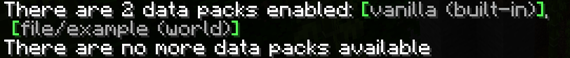

# Documentation

This is the documentation and guide for Armor Stand Animator and how to use it. Created by ReBrainerTV :)

# Project Setup

To create a new animation project, go to [https://armor-stand-animator.glitch.me/](https://armor-stand-animator.glitch.me/). Animations can be any length between 1 tick and 1200 ticks (60 seconds) depending on the information you put in the project.

Unfortunately, armor stand animation speed is capped at 20fps because Minecraft has 20 ticks per second, meaning that we are only able to switch frames using commands 20 times a second.

## Saving your project for later

To save your animation project to your computer and edit it later, go to the top of the screen and press `File > Save Project`. After you give your file a name, it will be downloaded to your computer as a `.mcanimation` file. This file is **NOT** compatible with Minecraft or any other animation software. When you want to come back and edit that project, you can go to `File > Load Project` to reupload that animation file and resume from where you left off.

## Uploading an audio file

Some animations are meant to go along with an accompanying audio file (a character giving a speech, a choreographed musical, etc). You can visualize this along with your animation by going to `File > Select Preview Audio`. A waveform will appear in the timeline and the audio will play along with your animation in playback.

Currently, this audio file is not saved to your project, meaning you will have to reupload it for each session.

# Markers

Markers are little symbols in the timeline at the bottom of the screen that contain user-inputted information about what happens at that point in the animation. They can make the armor stand's limbs move or execute commands in various other ways. 

Only one marker of each type can exist at the same point in time, so if you try to drag 2 markers on top of each other, they will merge (with priority going to the one(s) you just dropped). 

## Add a new marker

The simplest way to add a marker is to simply edit a property. If a marker does not already exist at the cursor's position, it will be created when you finish typing. You can also use the diamond button to manually add / remove motion markers at the current position.

## Selecting markers

You can multiselect markers to run many actions on them at once. Either hold CTRL and click on multiple markers to select/deselect them or click and drag in the timeline. If the markers are all of the same type, you'll be able to set all of their values in the above editor. Regardless of whether they are the same type, you can bulk move, delete, disable and duplicate markers. 

## Event Markers

Event markers are the simpler type of marker \- their purpose is to execute any Minecraft command at a specific point in the animation. For example, if I wanted the armor stand to spin and change armor halfway through its spin, I would use an event marker to replace the armor on the stand.

Add a command into an event marker using the upper Event editing screen. Commands should not be prefixed with a slash (for example, you should use `say hi` instead of `/say hi`). In addition, multiple commands can be added per event marker by adding a new line in the text box, similar to function files.

## Motion Markers

Motion markers are what bring your armor stand to life. Each bone and axis gets its own "track" with which to use animation markers, visible in the timeline. You can set any variation of poses on a single track and the computer will calculate how to get from point A to point B in the specified distance between the next set value in 20fps.

At the moment, in-game armor stand pose rotation is not interpolated so larger jumps will appear blocky and robotic, but this can't be helped unless Mojang decides to allow armor stand limb interpolation to let armor stand animations appear smoother than 20fps.

Motion markers allow you to rotate any axis of any limb on your armor stand. When you change any value, you'll see the preview model on the left adjust to fit the values you have inputted on the right. The stand's Head, Left Arm, Right Arm, Chest, Left Leg and Right Leg all have 3 axes you can modify individually and their values are measured in degrees. The Facing field lets you rotate the entire stand, but only the horizontal component will be rendered; you cannot visually tilt the entire stand upwards. 

Finally, the marker Interpolation Arrival Mode defines what algorithm the program uses to calculate the motion. If your cursor is hovering over a marker, the interpolation mode will be displayed in the Properties screen. There are 5 modes with which you can animate: None (snap immediately upon the marker existing without animating), Linear (go directly from point A to point B), Ease in-out, Ease in, and Ease out.

To create a motion, place down two Animation markers. Choose a limb and axis (for example, Head: Y axis) and put two different values in the markers' text boxes corresponding to that rotation axis. Make sure the second marker's Mode is set to something other than None so that the program will actually calculate rotational steps between the two points instead of instantly jumping between the two. You can preview your motion in playback.

## Disabled markers

Disabled markers sit in your timeline but don't have any function. They are totally ignored when exporting or calculating the preview. They are kind of like a "comment" feature to allow you to test out different ideas in the same timeline. You can disable a marker by going to `Edit > Disable markers`, right-clicking and selecting `Disable / Enable` or selecting the marker and pressing the "d" or zero (0) key.

# Playback & Model Preview

Not only can the side dummy preview the data you enter in markers, but it can also render the entire animation\! Once you have one or more valid motions, press the spacebar or the play button at the bottom of the screen to play your animation from the point you have scrolled to in the editor. The armor stand will run through the motions that you have programmed and you can see it in the browser before importing it into Minecraft.

The model preview cannot have armor or custom heads applied to it as this would require custom 3D model data, but you can see what a plain vanilla armor stand looks like while playing your animation. You can also make the model use the baby model, toggle the base plate and render without its texture in Silhouette mode in the View menu at the top of the screen.

The model preview has traditional 3D object orbit controls: hold right-click to move the camera, scroll wheel to zoom and left click & drag to orbit around the model preview. You can reset the position to the front of the stand by double-clicking the model preview screen or going to `View > Reset Camera Position`. 

## Rendering Options

Under the `View` menu, there are several handy rendering options:
- `Show Base Plate` allows you to toggle the visibility of the baseplate, similar to the in-game armor stand data property
- `Small Model` shows the model as a baby with an enlarged head, similar to the in-game armor stand data property
- `Silhouette` colors the entire armor stand black, removing lighting

Additionally, two Indicators exist to help you find your way when animating.
- `Show Forward Direction Indicator` will render a black arrow at the base that shows which direction is considered "forward"
- `Show Rotation Direction Indicator` will render a 3 arrows corresponding to the 3 axies, indicating which direction is positive when applying rotations

## Copy pose to clipboard

If you just want to save the pose currently shown on-screen, right-click the timeline and select "Copy Exact Current Pose" or "Copy Current Pose Changes". Exact Pose will set every bone's rotation exactly as seen on screen, whereas Pose Changes will only copy the bones that moved between the previous and current frame. You'll get a Minecraft-formatted /data command copied to your clipboard containing the information you entered in the selected animation markers. 

# Putting it into Minecraft

In order to put your animation into Minecraft, you must already have an understanding of command blocks, data packs and MCFUNCTION files.

Minecraft: Java Edition does not have any animation file support in vanilla, but we can change the rotation values of armor stands' limbs with NBT. Since Minecraft has 20 ticks in a second, we can only change animation frames 20 times a second, which means your animation is locked to 20fps. Frame 0 would be 0:00, frame 20 would be 0:01.   
To measure which frame the armor stand is on, a scoreboard objective is created. When you run the function file generated by the website in-game, your armor stand will switch its pose to the frame defined by the entity's scoreboard value. This means that you have full control over the in-game playback of your animation, but it also means it's a little more complicated to set up.

## Exporting to a data pack

If you don't have a data pack you already want to add your function file to, you can generate an entire data pack containing just your function file.

1. Create the world in Minecraft you want to import your animation data to.  
2. In the Armor Stand Animator, go to `File > Export > as data pack`. Give your file a name.  
3. You should get a .zip file downloaded to your computer. Navigate to your downloads folder and cut (ctrl \+ x) the file.  
4. Now find the folder containing your world data and open its datapacks directory.  
   1. Type `%appdata%` into the address bar of your file explorer  
   2. Open the `.minecraft` folder, then navigate into saves   
   3. Choose the appropriate world folder   
   4. Open the `datapacks` folder of that world
5. From here, you can paste your `.zip` file into the folder. Minecraft will recognize it even if you leave it as a `.zip` file, but I would recommend extracting the data because it makes it much easier to edit the datapack later.

If you're already in your world, you should be able to type `/reload` into the chat and your data pack will show up. If you're not yet in the world, you can just enter it and Minecraft should recognize the datapack.

You can check if Minecraft has recognised your datapack by running `/datapack list`.  

## Export to function file

If you already have a data pack on the world you want to add your animation to, you can choose to export your animation as a function file instead (`File > Export > as function file`). Place it in the `[datapack directory]/data/[namespace]/functions/` folder of your datapack. 

If you're already in your world, you should be able to type `/reload` into the chat and your function will show up. If you're not already in the world, you can just enter it and Minecraft should recognize the function.

## Export to a reduced function file

This is the same as a function file, except it will cut out all duplicate frames. Only use this if you intend to play animations exactly the same way each time from start to finish. This can greatly reduce strain on the server and help with lag.

## Export as Bedrock Animation

This is an experimental feature and will likely not work. It generates a Bedrock animation json file for use with behavior and resource packs. Not compatible with Java Edition.

## Playing the animation in-game

Now that you've imported the function file containing your animation into Minecraft, it's time to play it in-game.  
You'll need:

- Creative mode  
- An armor stand  
- 2-3 command blocks

First, place down your armor stand. You can put armor or items on it or edit its NBT in any way you want.   
Second of all, run the function file generated by the website (should be available as `/function <datapack filename>:<scoreboard name>`) to create the scoreboard. You need to do this at least once before you try animating your armor stand.  
Finally, place your command blocks down in a chain in this pattern:

| COMMAND BLOCK TYPE  | NEEDS REDSTONE | COMMAND |
| ------------------- | -------------- | ------------------------------------------------------------------------------------------- |
| Repeat              | Yes            | `/execute as @n[type=armor_stand] at @s run function <datapack filename>:<scoreboard name>` |
| Chain               | No             | `/scoreboard players add @n[type=armor_stand] <scoreboard name> 1`                          |

Finally, place a redstone block down beside the repeating block to start the chain. Your armor stand should play the animation\!

## Looping the animation or other forms of custom playback

You have complete control over your animation's playback in-game. Unfortunately, this also means that you'll have to manually program animation looping, start/stops, or backwards playback.   
You can achieve this by setting the armor stand's scoreboard entry to any frame and then running the function to apply the changes. For example,   
`/scoreboard players set @n[type=armor_stand,scores={<scoreboard name>=60}] <scoreboard name> 0` will restart your animation from the beginning when it has played for 60 ticks. You would add this command to your chain to check when the armor stand has reached specific parts of the animation.

# Advanced Features

There are a couple more advanced animation editing features that could uncomplicate the animating process for some. 

## Preview Frame-By-Frame Rotation

This option in the View menu enables frame preview as you scroll along in the editor. With this option off, the preview dummy will only move in the editor when you use the playback function. With this option on, the editor will automatically detect the current frame that the playback cursor is hovering over as it is dragged and switch the preview dummy's pose accordingly.
      
## Playback Pane

The Playback Pane is a GUI that logs each motion and event as it happens. It renders all the current properties of the armor stand and adds an entry in Logs when an event marker is triggered. 

## Keyboard Shortcuts

There's a couple useful keyboard shortcuts included to make editing faster.

- `Space` - Play / Pause playback
- `Delete` - Delete selected marker(s)
   - If you're currently typing in a text box, `Ctrl + Delete` will delete the marker (this is so that you can still use the Delete key for text editing)
- `D` - Disable / Enable current marker(s)
- `.` - Scroll forward one frame
- `[` - Scroll to previous marker that also has a value in the selected text box
- `]` - Scroll to next marker that also has a value in the selected text box
- `Ctrl + D` - Duplicate marker(s)
- `Ctrl + A` - Select all markers
- `Ctrl + S` - Save project